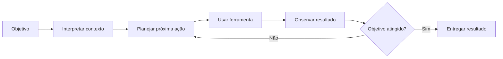
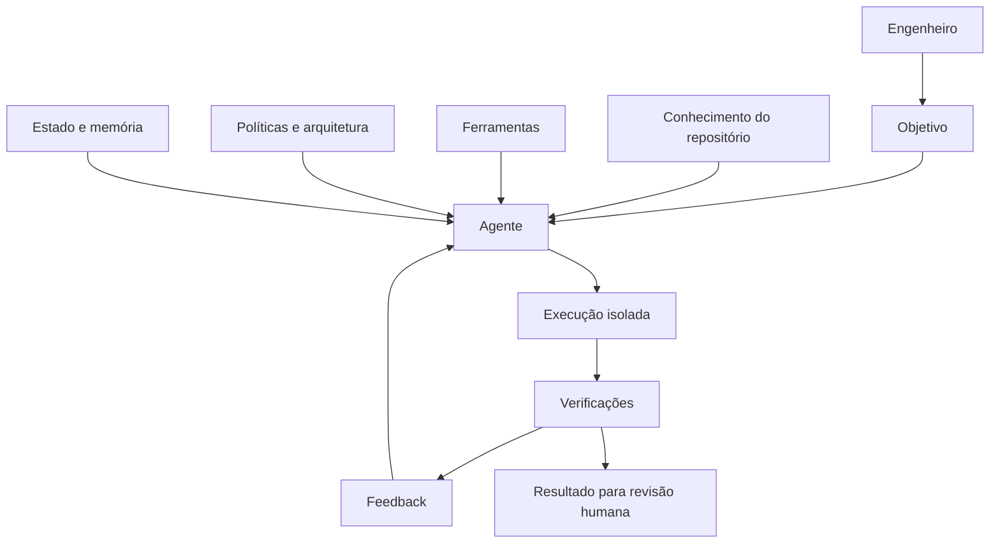
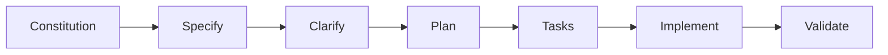
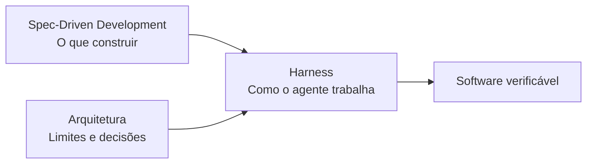
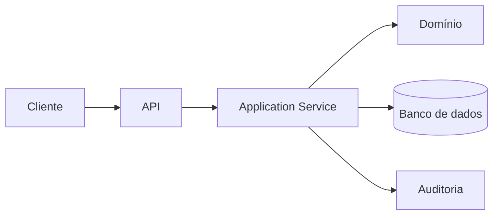
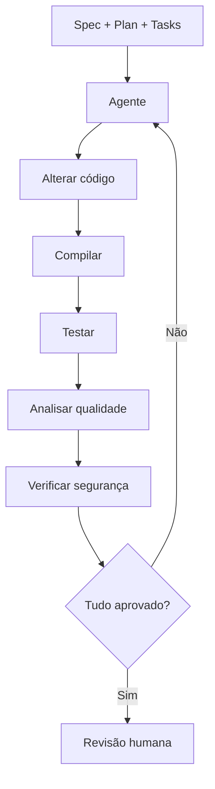
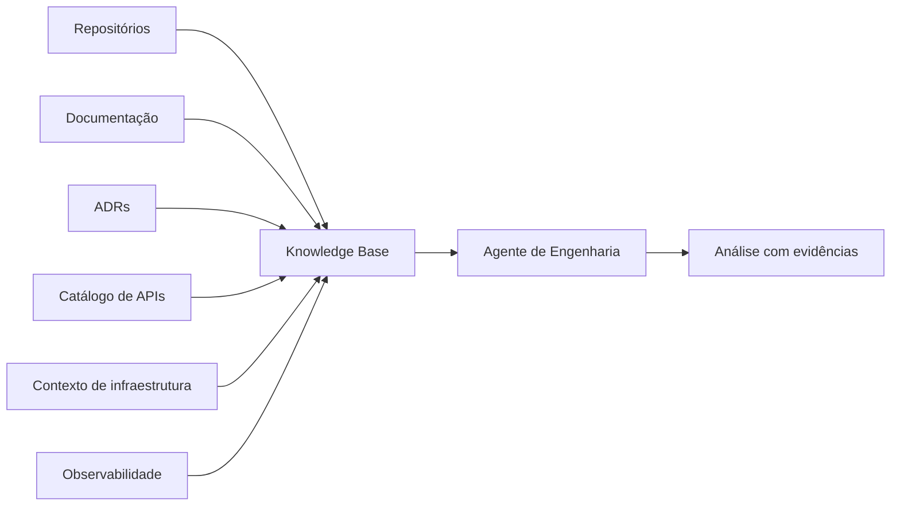

---
presentation:
  title: "Interseção da Arquitetura de Software e Inteligência Artificial"
  language: pt-BR
  audience: "Estudantes de Engenharia de Software, Ciência da Computação e áreas relacionadas — NPES/UFMS"
  objective: "Demonstrar que a IA aumenta, e não elimina, a importância da Engenharia de Software, e apresentar Harness Engineering como prática emergente que conecta Spec-Driven Development, arquitetura e agentes de IA."
  duration_minutes: 50
  slide_count: auto
  format: ppt169
brand:
  profile: facom-ufms
delivery:
  animations: purposeful
  speaker_notes: true
  citations: true
  output_name: harness-engineering-ufms.pptx
quality:
  mode: standard
---

# Interseção da Arquitetura de Software e Inteligência Artificial

## Uma breve introdução à Harness Engineering

---

## Metadados da apresentação

- **Palestrante:** Victor Lucas Lopes Silva
- **Cargo:** Especialista em Arquitetura de Software
- **Empresa:** Vivo
- **Evento:** Núcleo de Práticas em Engenharia de Software — NPES/UFMS
- **Data:** 28 de julho de 2026
- **Horário:** 20h00 em Campo Grande/MS — 21h00 no horário de Brasília
- **Duração planejada:** 50 minutos de apresentação e 10 minutos de perguntas
- **Idioma:** Português do Brasil
- **Formato:** palestra técnica, introdutória e prática
- **Público:** estudantes de Engenharia de Software, Ciência da Computação e áreas relacionadas
- **Nível esperado:** introdutório e intermediário
- **Link da transmissão:** https://meet.google.com/fko-crbm-xhc

---

## Tese central

A Inteligência Artificial não elimina a necessidade de Engenharia de Software.

Ela aumenta a importância de especificação, arquitetura, contexto, validação, segurança, observabilidade e responsabilidade técnica.

O engenheiro deixa de atuar somente como autor de código e passa a projetar ambientes nos quais humanos e agentes de IA conseguem produzir software de forma confiável.

---

## Mensagem principal para o público

> O ativo mais importante de um engenheiro de software nunca foi a capacidade de digitar código. Sempre foi a capacidade de compreender problemas, tomar decisões e construir sistemas confiáveis.

A IA reduz o custo de produzir código plausível.

Ao mesmo tempo, aumenta o valor das competências que permitem avaliar se esse código:

- resolve o problema correto;
- respeita a arquitetura;
- atende às regras de negócio;
- é seguro;
- pode ser observado;
- pode ser mantido;
- está apoiado em evidências;
- pode ser responsabilizado e auditado.

---

## Resultados de aprendizagem

Ao final da palestra, o público deverá conseguir:

1. diferenciar IA generativa, agentes de IA e sistemas agentivos;
2. compreender a evolução de Prompt Engineering para Context Engineering, Agent Engineering e Harness Engineering;
3. entender o papel da arquitetura em sistemas que utilizam agentes;
4. compreender os fundamentos de Spec-Driven Development;
5. conhecer o fluxo principal do GitHub Spec Kit;
6. entender por que especificações, testes e regras arquiteturais formam mecanismos de controle para agentes;
7. visualizar uma aplicação prática combinando SDD, arquitetura e Harness Engineering;
8. reconhecer as competências profissionais que ganham importância nesse novo cenário.

---

# Diretrizes narrativas

A apresentação deve seguir uma narrativa progressiva.

Não começar oferecendo uma definição acadêmica de Harness Engineering.

Primeiro apresentar a transformação da Engenharia de Software. Depois mostrar os problemas da geração de código sem estrutura. Em seguida introduzir especificação, contexto, agentes e mecanismos de controle. Harness Engineering deve surgir como uma consequência natural dessa evolução.

A narrativa deverá seguir a sequência:

1. o código ficou mais barato;
2. software não é apenas código;
3. modelos geram respostas, mas agentes executam processos;
4. agentes sem contexto e controle produzem resultados imprevisíveis;
5. o SDD organiza intenção e requisitos;
6. a arquitetura estabelece limites e decisões;
7. o harness fornece ambiente, ferramentas, feedback e governança;
8. o engenheiro passa a projetar o sistema de trabalho do agente;
9. a responsabilidade final continua sendo humana.

---

# Diretrizes visuais

A apresentação deve ter aparência de keynote técnica, evitando slides densos.

Priorizar:

- frases curtas;
- diagramas;
- fluxos;
- comparações;
- timelines;
- código apenas quando necessário;
- uma mensagem principal por slide;
- notas completas separadas do conteúdo visual.

Evitar:

- parágrafos extensos nos slides;
- fundos poluídos;
- excesso de ícones;
- diagramas excessivamente complexos;
- imagens genéricas de robôs humanoides;
- afirmações de que a IA substituirá completamente engenheiros;
- tratar ferramentas comerciais como evidência científica;
- apresentar previsões como fatos consolidados.

O deck deve usar preferencialmente uma identidade tecnológica sóbria, com alto contraste, tipografia moderna e diagramas minimalistas.

---

# Estrutura da apresentação

## Capítulo 1 — A Engenharia de Software está mudando

### Objetivo

Provocar o público e demonstrar que a transformação atual não se resume à chegada de uma nova ferramenta de autocomplete.

### Emoção desejada

Curiosidade e inquietação.

### Mensagem-chave

O custo de produzir código está diminuindo, mas o custo de produzir software incorreto continua alto.

---

## Slide 1 — Capa

### Título

Interseção da Arquitetura de Software e Inteligência Artificial

### Subtítulo

Uma breve introdução à Harness Engineering

### Informações adicionais

Victor Lucas Lopes Silva
Especialista em Arquitetura de Software @ Vivo
NPES — UFMS
28 de julho de 2026

### Tipo de slide

Capa minimalista.

### Sugestão visual

Uma composição abstrata ligando arquitetura, código, agentes e mecanismos de validação.

Não utilizar robô humanoide.

### Notas do apresentador

Apresentar-se brevemente.

Explicar que a conversa não será sobre "dez prompts para programar mais rápido".

A palestra tratará de como a IA está alterando o processo de Engenharia de Software, o papel da arquitetura e a responsabilidade do engenheiro.

Informar que a palestra combina conceitos, práticas corporativas, pesquisa e uma demonstração baseada em Spec-Driven Development.

---

## Slide 2 — Pergunta de abertura

### Conteúdo principal

> Daqui a cinco anos, ainda desenvolveremos software da mesma forma?

### Tipo de slide

Pergunta provocativa.

### Sugestão visual

Somente a pergunta em destaque, com bastante espaço vazio.

### Interação

Pedir que os alunos levantem a mão em três grupos:

1. quem acredita que escreverá mais código;
2. quem acredita que escreverá menos código;
3. quem acredita que o trabalho mudará, mas não desaparecerá.

### Notas do apresentador

Não responder imediatamente.

Explicar que previsões sobre substituição profissional costumam simplificar uma transformação muito mais complexa.

A pergunta mais útil não é "a IA vai substituir programadores?", mas:

> Quais atividades serão automatizadas, quais serão ampliadas e quais passarão a exigir ainda mais responsabilidade humana?

---

## Slide 3 — Código não é software

### Conteúdo principal

```text
Código
≠
Software
```

### Conteúdo de apoio

Software também envolve:

- requisitos;
- arquitetura;
- regras de negócio;
- segurança;
- dados;
- integração;
- operação;
- evolução;
- responsabilidade.

### Tipo de slide

Contraste conceitual.

### Sugestão visual

A palavra "Código" pequena dentro de um sistema maior chamado "Software".

### Notas do apresentador

Um modelo pode produzir centenas de linhas de código em segundos.

Isso não significa que ele compreendeu corretamente o problema, o contexto da organização, as restrições de segurança, os compromissos arquiteturais ou os efeitos operacionais.

Código é um dos artefatos da Engenharia de Software, não o sistema inteiro.

---

## Slide 4 — A mudança de escassez

### Conteúdo principal

Antes:

> Escrever código era caro.

Agora:

> Validar intenção e resultado torna-se o gargalo.

### Tipo de slide

Antes e depois.

### Sugestão visual

Duas colunas.

Na primeira:

- implementação manual;
- velocidade limitada;
- alto custo de produção.

Na segunda:

- geração abundante;
- múltiplas alternativas;
- maior custo de revisão;
- necessidade de evidência.

### Notas do apresentador

A IA generativa reduz o custo inicial de produzir uma solução plausível.

Porém, "plausível" não significa "correta".

Quando produzir alternativas se torna barato, cresce a necessidade de:

- definir claramente o problema;
- estabelecer restrições;
- avaliar resultados;
- executar testes;
- verificar segurança;
- controlar mudanças;
- preservar coerência arquitetural.

---

## Slide 5 — Evolução do papel do engenheiro

### Conteúdo principal

```text
Autor de código
      ↓
Projetista de sistemas
      ↓
Orquestrador de ferramentas
      ↓
Projetista de ambientes para agentes
```

### Tipo de slide

Timeline profissional.

### Notas do apresentador

Essas etapas não são substituições absolutas.

Continuaremos escrevendo código, projetando sistemas e utilizando ferramentas.

A transformação está na proporção das atividades.

O engenheiro tende a dedicar mais tempo a:

- explicitar intenção;
- fornecer contexto;
- projetar limites;
- avaliar evidências;
- revisar decisões;
- governar automações.

---

# Capítulo 2 — De modelos que respondem a agentes que atuam

## Slide 6 — IA generativa não é sinônimo de agente

### Conteúdo principal

```text
Modelo:
entrada → resposta

Agente:
objetivo → decisão → ferramenta → observação → próxima ação
```

### Tipo de slide

Comparação.

### Sugestão visual

Dois fluxos.

Fluxo simples para o modelo e um loop para o agente.

### Notas do apresentador

Um modelo de linguagem transforma contexto de entrada em uma resposta.

Um agente utiliza o modelo dentro de um ciclo de execução.

O agente pode:

- interpretar um objetivo;
- planejar;
- escolher ferramentas;
- consultar arquivos;
- executar comandos;
- observar resultados;
- corrigir erros;
- continuar até atingir uma condição de parada.

---

## Slide 7 — O loop de um agente

### Conteúdo principal



### Tipo de slide

Diagrama de processo.

### Notas do apresentador

Destacar que o modelo não é o sistema inteiro.

Existem componentes externos responsáveis por:

- controlar o loop;
- fornecer ferramentas;
- armazenar estado;
- limitar ações;
- coletar logs;
- verificar resultados;
- interromper comportamentos incorretos.

Esses elementos começam a formar o harness.

---

## Slide 8 — Por que software é um domínio favorável para agentes?

### Conteúdo principal

- código pode ser executado;
- testes produzem feedback;
- compiladores detectam erros;
- linters verificam regras;
- repositórios preservam histórico;
- pipelines aplicam políticas;
- resultados podem ser comparados.

### Tipo de slide

Lista visual.

### Notas do apresentador

Agentes são particularmente interessantes em Engenharia de Software porque parte significativa do trabalho pode ser verificada automaticamente.

Um agente pode gerar uma alteração, executar testes, observar uma falha e tentar uma correção.

Isso não garante que o comportamento de negócio esteja correto, mas fornece sinais objetivos que outros domínios nem sempre possuem.

A Anthropic destaca verificabilidade, testes e feedback iterativo como fatores que tornam agentes de código um caso especialmente promissor.

---

# Capítulo 3 — A evolução das práticas de engenharia para IA

## Slide 9 — Do prompt ao harness

### Conteúdo principal

```text
Prompt Engineering
        ↓
Context Engineering
        ↓
Agent Engineering
        ↓
Harness Engineering
```

### Tipo de slide

Escada de maturidade.

### Notas do apresentador

Explicar que os termos não representam uma hierarquia rígida ou uma sequência universal.

Eles destacam diferentes problemas.

Prompt Engineering pergunta:

> Como formular uma instrução útil?

Context Engineering pergunta:

> Qual informação deve estar disponível no momento certo?

Agent Engineering pergunta:

> Como criar um sistema que planeja, usa ferramentas e executa tarefas?

Harness Engineering pergunta:

> Como construir o ambiente que torna a execução do agente confiável, observável, repetível e governável?

---

## Slide 10 — Prompt Engineering

### Conteúdo principal

> Como pedir?

### Conteúdo de apoio

- instruções;
- formato de saída;
- exemplos;
- restrições;
- papel esperado.

### Tipo de slide

Conceito simples.

### Notas do apresentador

Prompt Engineering continua sendo útil.

O problema aparece quando se tenta resolver um sistema complexo apenas criando um prompt gigantesco.

Prompts não substituem:

- documentação;
- arquitetura;
- testes;
- ferramentas;
- controle de acesso;
- observabilidade;
- gestão de estado.

---

## Slide 11 — Context Engineering

### Conteúdo principal

> O que o agente precisa saber agora?

### Conteúdo de apoio

- código relevante;
- documentação;
- regras;
- ADRs;
- exemplos;
- histórico;
- estado da tarefa;
- resultados de ferramentas.

### Tipo de slide

Contexto em camadas.

### Notas do apresentador

Context Engineering consiste em selecionar, organizar e disponibilizar informações relevantes para a tarefa.

Mais contexto não significa necessariamente melhor resultado.

Contexto excessivo, contraditório ou desatualizado pode prejudicar o agente.

A responsabilidade da engenharia é entregar contexto:

- relevante;
- confiável;
- rastreável;
- atualizado;
- adequado ao estágio da tarefa.

---

## Slide 12 — Agent Engineering

### Conteúdo principal

> Como o agente trabalha?

### Conteúdo de apoio

- objetivos;
- planejamento;
- ferramentas;
- memória;
- estado;
- delegação;
- critérios de parada.

### Tipo de slide

Arquitetura de agente.

### Notas do apresentador

Agent Engineering trata do sistema que permite ao modelo atuar.

Um agente de desenvolvimento pode receber acesso a:

- sistema de arquivos;
- Git;
- terminal;
- compilador;
- testes;
- documentação;
- gerenciador de tarefas;
- APIs;
- ambientes isolados.

A capacidade do agente não depende somente do modelo, mas da qualidade dessas integrações.

---

# Capítulo 4 — Harness Engineering

## Slide 13 — O que é um harness?

### Conteúdo principal

> Harness é o sistema ao redor do modelo que transforma capacidade probabilística em trabalho controlado.

### Tipo de slide

Definição central.

### Sugestão visual

O modelo no centro, envolvido por camadas.

### Camadas visuais

- contexto;
- ferramentas;
- estado;
- execução;
- validação;
- segurança;
- observabilidade;
- governança.

### Notas do apresentador

A palavra harness pode ser compreendida como arreio, estrutura de suporte ou mecanismo de controle.

Na Engenharia de IA, o harness é o ambiente que orienta e limita o agente.

O harness não remove a incerteza do modelo.

Ele cria mecanismos para:

- detectar falhas;
- reduzir comportamentos inconsistentes;
- fornecer evidências;
- repetir processos;
- limitar impacto;
- permitir supervisão.

---

## Slide 14 — Modelo versus sistema

### Conteúdo principal

```text
Modelo poderoso
sem contexto e controle
=
resultado imprevisível
```

```text
Modelo
+ contexto
+ ferramentas
+ testes
+ políticas
+ observabilidade
=
sistema de engenharia
```

### Tipo de slide

Equação conceitual.

### Notas do apresentador

Empresas não colocam apenas um modelo de linguagem em produção.

Elas constroem sistemas ao redor dele.

Esses sistemas lidam com:

- identidade;
- autorização;
- dados;
- ferramentas;
- isolamento;
- orçamento;
- tempo;
- auditoria;
- qualidade;
- riscos.

---

## Slide 15 — Componentes de um harness de Engenharia de Software

### Conteúdo principal



### Tipo de slide

Diagrama de arquitetura.

### Notas do apresentador

Apresentar os elementos individualmente:

**Conhecimento:** documentação, código, ADRs, convenções e regras de negócio.

**Ferramentas:** Git, terminal, testes, APIs, bancos, ambientes e observabilidade.

**Políticas:** limites técnicos, segurança, padrões arquiteturais e permissões.

**Estado:** progresso, decisões anteriores e resultados intermediários.

**Execução isolada:** sandbox ou ambiente controlado.

**Verificações:** compilação, testes, análise estática, segurança e critérios de aceitação.

**Revisão humana:** responsabilidade e aprovação final.

---

## Slide 16 — O repositório como fonte da verdade

### Conteúdo principal

> Conhecimento que não está acessível ao agente não participa da decisão.

### Conteúdo de apoio

- README;
- AGENTS.md;
- CLAUDE.md;
- ADRs;
- documentação arquitetural;
- especificações;
- regras de contribuição;
- exemplos;
- testes;
- scripts de validação.

### Tipo de slide

Repositório como mapa.

### Notas do apresentador

Um ponto recorrente em Harness Engineering é tornar o repositório legível para agentes.

Conhecimento tácito, espalhado em conversas ou conhecido apenas por pessoas experientes, não pode orientar consistentemente um agente.

Isso não significa colocar toda a empresa em um arquivo.

Significa transformar decisões relevantes em artefatos localizáveis, claros e verificáveis.

---

## Slide 17 — Arquitetura executável

### Conteúdo principal

> Uma regra arquitetural que existe apenas em um diagrama é uma recomendação.
> Uma regra validada automaticamente torna-se parte do sistema.

### Exemplos

- impedir dependência entre camadas proibidas;
- validar convenções de API;
- controlar bibliotecas autorizadas;
- exigir telemetria;
- verificar limites de módulos;
- identificar violações de segurança;
- bloquear alterações sem testes.

### Tipo de slide

Arquitetura como política.

### Notas do apresentador

A arquitetura deixa de ser apenas documentação e passa a fornecer feedback.

Exemplos de mecanismos:

- testes de arquitetura;
- fitness functions;
- linters customizados;
- políticas de pipeline;
- contratos;
- schemas;
- quality gates.

Esses mecanismos ajudam humanos e agentes.

---

# Capítulo 5 — Spec-Driven Development

## Slide 18 — O problema do desenvolvimento orientado apenas por prompt

### Conteúdo principal

```text
"Crie um sistema de pedidos."
```

### Resultado esperado no slide

Perguntas que permanecem sem resposta:

- para quem?
- qual problema?
- quais regras?
- qual volume?
- quais restrições?
- como validar?
- o que não deve ser construído?

### Tipo de slide

Prompt insuficiente.

### Notas do apresentador

Um pedido genérico pode produzir uma demonstração visualmente convincente.

Mas uma solução corporativa exige decisões explícitas.

O perigo não é apenas produzir código ruim.

É produzir rapidamente o sistema errado.

---

## Slide 19 — O que é Spec-Driven Development?

### Conteúdo principal

> A especificação deixa de ser um documento descartável e passa a orientar diretamente o planejamento, a implementação e a validação.

### Tipo de slide

Definição.

### Notas do apresentador

No Spec-Driven Development, o código não é o primeiro artefato.

Começamos pela intenção.

A especificação descreve:

- problema;
- atores;
- comportamento;
- regras;
- restrições;
- casos de uso;
- critérios de aceitação;
- condições de erro.

Com agentes, essa especificação também se torna uma entrada operacional para planejamento e implementação.

---

## Slide 20 — Fluxo do GitHub Spec Kit

### Conteúdo principal



### Conteúdo complementar

- **Constitution:** princípios estáveis do projeto;
- **Specify:** definição do que será construído;
- **Clarify:** resolução de ambiguidades;
- **Plan:** estratégia técnica;
- **Tasks:** decomposição do trabalho;
- **Implement:** execução orientada pelos artefatos;
- **Validate:** verificação contra a intenção.

### Tipo de slide

Fluxo de processo.

### Notas do apresentador

Apresentar o Spec Kit como um exemplo de processo SDD, não como a única forma possível de implementar SDD.

Destacar a separação entre:

- o que deve ser construído;
- como será construído;
- quais tarefas serão executadas.

Essa separação reduz ambiguidades e melhora a capacidade de revisão.

---

## Slide 21 — SDD não é Waterfall com IA

### Conteúdo principal

```text
Especificação
↕
Clarificação
↕
Plano
↕
Implementação
↕
Feedback
```

### Tipo de slide

Mito versus realidade.

### Notas do apresentador

SDD não significa criar uma especificação perfeita e imutável antes de qualquer aprendizado.

A especificação pode evoluir.

A diferença é que mudanças de intenção devem ser refletidas nos artefatos, em vez de ficarem escondidas somente no código ou na conversa com o agente.

O processo continua iterativo.

---

## Slide 22 — O encontro entre SDD e Harness Engineering

### Conteúdo principal

> SDD organiza a intenção.
> Arquitetura estabelece os limites.
> O harness controla a execução.

### Tipo de slide

Síntese em três blocos.

### Diagrama



### Notas do apresentador

Essa é uma das mensagens mais importantes da palestra.

O SDD fornece objetivos, requisitos e critérios.

A arquitetura fornece princípios, restrições e decisões.

O harness combina contexto, ferramentas, execução e feedback.

Separadamente, nenhum desses elementos garante sucesso.

Em conjunto, eles criam uma abordagem mais disciplinada para o desenvolvimento assistido por agentes.

---

# Capítulo 6 — Demonstração prática

## Slide 23 — Cenário da demonstração

### Título

Vamos criar uma funcionalidade sem começar pelo código

### Cenário

Uma universidade deseja disponibilizar uma API para inscrição de estudantes em palestras.

### Requisitos iniciais

- estudantes podem consultar palestras;
- estudantes podem realizar inscrição;
- cada palestra possui limite de vagas;
- uma pessoa não pode se inscrever duas vezes;
- inscrições devem ser auditáveis;
- a API deve tratar concorrência;
- a solução deve possuir testes.

### Tipo de slide

Contexto do exercício.

### Notas do apresentador

O cenário é simples o suficiente para ser compreendido rapidamente, mas contém problemas reais:

- concorrência;
- idempotência;
- consistência;
- autenticação;
- auditoria;
- regras de negócio;
- testes.

---

## Slide 24 — Etapa 1: Constitution

### Conteúdo principal

```markdown
# Princípios do projeto

1. Regras de negócio não dependem do framework.
2. Toda alteração deve possuir testes automatizados.
3. APIs devem utilizar contratos explícitos.
4. Operações de escrita devem ser auditáveis.
5. Dados pessoais não devem aparecer em logs.
6. Falhas devem produzir respostas observáveis e rastreáveis.
```

### Tipo de slide

Exemplo de artefato.

### Notas do apresentador

A constitution representa princípios estáveis.

Ela não descreve uma funcionalidade específica.

Serve como um conjunto de limites para todas as decisões posteriores.

Relacionar isso ao papel tradicional da arquitetura:

- princípios;
- padrões;
- restrições;
- requisitos de qualidade.

---

## Slide 25 — Etapa 2: Specify

### Conteúdo principal

```markdown
# Feature: Inscrição em palestras

## Objetivo

Permitir que um estudante autenticado reserve uma vaga disponível.

## Critérios de aceitação

- A inscrição deve ser rejeitada quando não houver vagas.
- O mesmo estudante não pode possuir duas inscrições ativas.
- Repetir a mesma requisição não pode gerar duplicidade.
- Toda inscrição aceita ou rejeitada deve gerar um evento de auditoria.
```

### Tipo de slide

Exemplo de especificação.

### Notas do apresentador

Mostrar que a especificação descreve comportamento e valor.

Evitar antecipar tecnologias nesta etapa.

Não definir inicialmente:

- Java;
- Spring;
- PostgreSQL;
- Kafka;
- Kubernetes.

Primeiro definir o problema e os resultados observáveis.

---

## Slide 26 — Etapa 3: Clarify

### Conteúdo principal

Perguntas que o agente deverá fazer:

1. Como identificar o estudante?
2. É permitido cancelar uma inscrição?
3. Uma vaga cancelada volta a ficar disponível?
4. Qual comportamento esperado em requisições concorrentes?
5. A auditoria precisa ser síncrona?
6. Qual a política de retenção dos dados?
7. Existe lista de espera?

### Tipo de slide

Perguntas em destaque.

### Notas do apresentador

Um bom agente não apenas gera uma resposta.

Ele identifica decisões ausentes.

A etapa de clarificação é um mecanismo contra a falsa confiança.

O objetivo não é impedir toda ambiguidade, mas tornar explícitas as ambiguidades capazes de alterar a solução.

---

## Slide 27 — Etapa 4: Plan

### Conteúdo principal

```markdown
# Plano técnico resumido

- API REST para consulta e inscrição.
- Serviço de aplicação para coordenar o caso de uso.
- Domínio responsável pelas regras de capacidade e duplicidade.
- Persistência relacional com restrição única.
- Controle transacional para concorrência.
- Registro de auditoria sem dados pessoais sensíveis.
- Testes unitários, de integração e concorrência.
```

### Diagrama



### Tipo de slide

Plano e arquitetura.

### Notas do apresentador

Agora entram decisões técnicas.

O plano deve conectar requisitos a mecanismos.

Exemplo:

- "não duplicar inscrições" pode ser apoiado por uma regra de domínio e uma restrição única;
- "não ultrapassar capacidade" exige estratégia de concorrência;
- "ser auditável" exige registro consistente e rastreável.

---

## Slide 28 — Etapa 5: Tasks

### Conteúdo principal

```markdown
1. Criar contrato da API.
2. Modelar entidade de inscrição.
3. Implementar regra de duplicidade.
4. Implementar controle de capacidade.
5. Criar persistência e restrições.
6. Implementar auditoria.
7. Criar testes unitários.
8. Criar testes de integração.
9. Criar teste de concorrência.
10. Atualizar documentação.
```

### Tipo de slide

Decomposição de trabalho.

### Notas do apresentador

As tarefas devem ser pequenas, verificáveis e ordenadas por dependência.

O agente passa a trabalhar com um plano observável.

Isso facilita:

- acompanhar progresso;
- revisar decisões;
- interromper execução;
- retomar trabalho;
- identificar falhas.

---

## Slide 29 — O harness durante a implementação

### Conteúdo principal



### Tipo de slide

Loop de implementação.

### Notas do apresentador

Mostrar que o agente não recebe apenas uma tarefa e entrega código.

O ambiente fornece feedback.

Exemplos de verificações:

- build;
- testes;
- lint;
- cobertura;
- arquitetura;
- análise de dependências;
- SAST;
- contratos;
- critérios de aceitação.

Esse ciclo representa Harness Engineering aplicado à implementação.

---

## Slide 30 — Exemplo de regra arquitetural verificável

### Conteúdo principal

```text
Domínio não pode depender de:

- framework web;
- persistência;
- mensageria;
- infraestrutura.
```

### Pseudocódigo de validação

```java
noClasses()
    .that().resideInPackage("..domain..")
    .should().dependOnClassesThat()
    .resideInAnyPackage(
        "..web..",
        "..persistence..",
        "..infrastructure.."
    );
```

### Tipo de slide

Código com explicação.

### Notas do apresentador

Não é necessário explicar toda a sintaxe.

A mensagem é que uma decisão arquitetural pode ser convertida em uma verificação executável.

Quando o agente viola a regra, recebe feedback objetivo.

Isso reduz a dependência de prompts como:

> "Por favor, lembre-se de respeitar a arquitetura."

---

## Slide 31 — Resultado da demonstração

### Conteúdo principal

O resultado não é apenas código.

O processo produziu:

- especificação;
- decisões explícitas;
- plano técnico;
- tarefas rastreáveis;
- implementação;
- testes;
- evidências;
- documentação;
- histórico de decisões.

### Tipo de slide

Checklist de artefatos.

### Notas do apresentador

Comparar dois cenários.

**Cenário A:** pedir ao agente para criar uma API.

**Cenário B:** fornecer constituição, especificação, clarificação, plano, tarefas, ferramentas e validações.

O modelo pode ser o mesmo.

A diferença está no sistema de engenharia ao redor dele.

---

# Capítulo 7 — Aplicação corporativa

## Slide 32 — O desafio corporativo

### Conteúdo principal

Imagine um ecossistema com:

- centenas de serviços;
- múltiplos canais;
- APIs internas e externas;
- eventos;
- dados distribuídos;
- Kubernetes;
- service mesh;
- pipelines;
- sistemas legados;
- políticas de segurança;
- decisões acumuladas durante anos.

### Tipo de slide

Ecossistema complexo.

### Notas do apresentador

Um novo profissional leva tempo para compreender esse ambiente.

Um agente também não compreende automaticamente.

Ter acesso ao repositório não significa compreender:

- fronteiras de domínio;
- criticidade;
- contratos;
- responsáveis;
- dependências;
- restrições regulatórias;
- consequências operacionais.

---

## Slide 33 — De documentação passiva para conhecimento operacional

### Conteúdo principal



### Tipo de slide

Arquitetura de conhecimento.

### Notas do apresentador

O objetivo não é simplesmente alimentar um modelo com todos os documentos.

É construir mecanismos de recuperação, seleção, proveniência e atualização.

O agente deve conseguir responder:

- de onde veio essa informação?
- ela ainda é válida?
- qual decisão arquitetural a sustenta?
- quais evidências foram utilizadas?
- o que não foi possível confirmar?

---

## Slide 34 — Casos de uso corporativos

### Conteúdo principal

- análise de impacto;
- modernização de sistemas;
- revisão arquitetural;
- documentação de repositórios;
- geração de testes;
- investigação de incidentes;
- análise de dependências;
- revisão de pull requests;
- detecção de violações;
- apoio ao onboarding;
- avaliação de segurança;
- planejamento de migração.

### Tipo de slide

Mapa de aplicações.

### Notas do apresentador

Evitar prometer autonomia total.

Em ambientes corporativos, os casos mais valiosos frequentemente combinam:

- automação;
- recuperação de conhecimento;
- análise;
- recomendação;
- geração de evidências;
- revisão humana.

---

## Slide 35 — Zero Trust também se aplica a agentes

### Conteúdo principal

> Nunca confiar implicitamente.
> Sempre verificar.
> Conceder somente o acesso necessário.

### Conteúdo de apoio

- identidade do usuário;
- identidade do agente;
- autorização por ferramenta;
- escopo mínimo;
- credenciais temporárias;
- isolamento;
- auditoria;
- aprovação para ações críticas.

### Tipo de slide

Segurança e governança.

### Notas do apresentador

Um agente não deve receber acesso irrestrito porque "precisa trabalhar".

O princípio de menor privilégio continua válido.

A organização deve controlar:

- quem solicitou a ação;
- qual agente executou;
- quais dados foram acessados;
- quais ferramentas foram utilizadas;
- quais alterações foram produzidas;
- quem aprovou o resultado.

---

# Capítulo 8 — Limitações e riscos

## Slide 36 — Agentes erram de forma convincente

### Conteúdo principal

- inventam APIs;
- interpretam incorretamente requisitos;
- utilizam contexto desatualizado;
- produzem testes insuficientes;
- repetem padrões ruins;
- introduzem vulnerabilidades;
- aumentam complexidade;
- escondem incerteza em respostas plausíveis.

### Tipo de slide

Alerta visual.

### Notas do apresentador

Não tratar alucinação como o único problema.

Mesmo uma resposta factual pode ser inadequada ao contexto arquitetural.

Um agente pode produzir código que compila e passa nos testes, mas:

- viola uma regra de negócio não testada;
- aumenta acoplamento;
- reduz manutenibilidade;
- cria risco operacional;
- expõe informações;
- resolve o problema errado.

---

## Slide 37 — Velocidade sem controle produz dívida mais rápido

### Conteúdo principal

> A IA pode acelerar tanto a entrega quanto a criação de entropia.

### Conteúdo de apoio

Mais código pode significar:

- mais dependências;
- mais abstrações;
- mais superfície de ataque;
- mais custo de manutenção;
- mais necessidade de revisão.

### Tipo de slide

Frase de impacto.

### Notas do apresentador

Produtividade não deve ser medida apenas por:

- linhas de código;
- quantidade de commits;
- número de pull requests;
- velocidade inicial.

Também devem ser considerados:

- defeitos;
- retrabalho;
- complexidade;
- segurança;
- tempo de revisão;
- manutenção;
- impacto operacional.

---

## Slide 38 — Autonomia deve ser proporcional à evidência

### Conteúdo principal

```text
Baixa evidência
→ recomendação

Evidência intermediária
→ alteração com revisão

Alta evidência e baixo risco
→ automação controlada
```

### Tipo de slide

Escala de autonomia.

### Notas do apresentador

Nem toda tarefa precisa do mesmo nível de supervisão.

Exemplos de menor risco:

- atualizar documentação;
- corrigir formatação;
- criar testes adicionais;
- gerar relatório.

Exemplos de maior risco:

- modificar autenticação;
- alterar dados;
- mudar infraestrutura;
- realizar deploy;
- excluir recursos;
- alterar regras financeiras.

---

# Capítulo 9 — Como muda a carreira

## Slide 39 — Competências que ganham importância

### Conteúdo principal

- Engenharia de Requisitos;
- Arquitetura de Software;
- modelagem de domínio;
- testes e verificação;
- segurança;
- observabilidade;
- dados;
- documentação;
- comunicação;
- pensamento crítico;
- governança;
- ética profissional.

### Tipo de slide

Competências futuras.

### Notas do apresentador

A IA não torna fundamentos irrelevantes.

Ela aumenta a necessidade de fundamentos.

Sem conhecimento de Engenharia de Software, é difícil perceber quando uma resposta está errada, incompleta ou inadequada.

---

## Slide 40 — O engenheiro deixa de ser somente executor

### Conteúdo principal

```text
Menos:
traduzir mecanicamente tarefas em código

Mais:
definir intenção
projetar limites
selecionar contexto
avaliar evidências
governar execução
```

### Tipo de slide

Transformação de função.

### Notas do apresentador

Isso não significa que profissionais iniciantes devam deixar de aprender programação.

Para revisar e orientar agentes, é necessário compreender:

- algoritmos;
- estruturas;
- paradigmas;
- sistemas;
- dados;
- redes;
- segurança;
- arquitetura.

Delegar uma atividade sem conseguir avaliá-la cria dependência, não produtividade.

---

## Slide 41 — Um plano prático para estudantes

### Conteúdo principal

1. fortaleça fundamentos;
2. use IA para explicar, não apenas entregar;
3. escreva especificações;
4. transforme regras em testes;
5. registre decisões;
6. construa pequenos agentes;
7. aprenda ferramentas e APIs;
8. estude segurança;
9. avalie resultados criticamente;
10. mantenha responsabilidade sobre o que entrega.

### Tipo de slide

Plano de ação.

### Notas do apresentador

Propor um exercício para os alunos:

Escolher um projeto acadêmico existente e adicionar:

- uma constitution;
- uma especificação de feature;
- um plano técnico;
- critérios de aceitação;
- testes;
- uma regra arquitetural verificável;
- instruções para um agente.

Depois comparar o resultado com uma implementação baseada somente em um prompt genérico.

---

# Capítulo 10 — Fechamento

## Slide 42 — A síntese

### Conteúdo principal

```text
Intenção
+ contexto
+ arquitetura
+ ferramentas
+ feedback
+ governança
=
Engenharia de Software com agentes
```

### Tipo de slide

Síntese conceitual.

### Notas do apresentador

Revisar os conceitos apresentados:

- modelos respondem;
- agentes executam loops;
- SDD organiza intenção;
- arquitetura define limites;
- harness controla o ambiente;
- verificações geram evidências;
- humanos mantêm responsabilidade.

---

## Slide 43 — Frase final

### Conteúdo principal

> O futuro da Engenharia de Software não será definido por quem gera mais código, mas por quem consegue transformar intenção em sistemas confiáveis.

### Tipo de slide

Frase de encerramento.

### Notas do apresentador

Pausar após a frase.

Reforçar:

A IA pode ampliar significativamente nossa capacidade de construção.

Contudo, amplificar capacidade sem ampliar disciplina também amplifica riscos.

O papel do engenheiro e do arquiteto é fazer com que essa capacidade produza valor de forma segura, sustentável e responsável.

---

## Slide 44 — Perguntas

### Conteúdo principal

Perguntas?

### Conteúdo secundário

Victor Lucas Lopes Silva
Especialista em Arquitetura de Software @ Vivo

### Tipo de slide

Encerramento.

---

# Demonstração prática sugerida

A demonstração poderá ser executada em um repositório pequeno criado exclusivamente para a palestra.

## Estrutura sugerida

```text
student-events-api/
├── .specify/
│   └── memory/
│       └── constitution.md
├── specs/
│   └── 001-event-registration/
│       ├── spec.md
│       ├── plan.md
│       └── tasks.md
├── src/
├── tests/
├── AGENTS.md
└── README.md
```

## Sequência da demonstração

1. Mostrar um pedido genérico:

```text
Crie uma API para inscrição de estudantes em palestras.
```

2. Perguntar à plateia o que está faltando.

3. Mostrar a constitution.

4. Executar ou simular a fase de specification.

5. Mostrar perguntas de clarificação.

6. Mostrar o plano técnico gerado.

7. Mostrar as tarefas.

8. Solicitar a implementação de uma tarefa.

9. Executar testes.

10. Introduzir uma violação arquitetural proposital.

11. Mostrar uma verificação falhando.

12. Solicitar que o agente corrija a alteração.

13. Mostrar o resultado e as evidências.

## Plano alternativo em caso de falha da demo ao vivo

Preparar capturas ou trechos previamente gerados contendo:

- especificação;
- plano;
- tarefas;
- alteração de código;
- teste falhando;
- correção;
- teste aprovado.

A palestra não deve depender de conexão externa para concluir sua mensagem.

---

# Exemplo completo de entrada SDD

## Constituição resumida

```markdown
# Constitution

## I. Domínio independente

Regras de negócio devem permanecer independentes de frameworks, protocolos e persistência.

## II. Verificação obrigatória

Toda regra de negócio deve possuir teste automatizado.

## III. Contratos explícitos

APIs e eventos devem possuir contratos versionados.

## IV. Segurança por padrão

Dados pessoais não devem aparecer em logs ou mensagens de erro.

## V. Observabilidade

Operações de escrita devem produzir logs estruturados, métricas e rastreabilidade.

## VI. Simplicidade

Uma nova abstração deve resolver um problema demonstrável, não apenas antecipar necessidades futuras.
```

## Especificação resumida

```markdown
# Inscrição em palestra

## Problema

Estudantes precisam reservar vagas em palestras do NPES.

## Ator principal

Estudante autenticado.

## Fluxo principal

1. O estudante seleciona uma palestra.
2. O sistema verifica se existe inscrição ativa.
3. O sistema verifica a disponibilidade.
4. O sistema registra a inscrição.
5. O sistema atualiza a disponibilidade.
6. O sistema registra auditoria.
7. O sistema confirma a inscrição.

## Critérios de aceitação

- Não permitir duplicidade.
- Não ultrapassar a capacidade.
- Garantir idempotência.
- Registrar tentativas aceitas e rejeitadas.
- Não expor dados pessoais nos logs.
- Responder conflitos de forma consistente.
```

## Perguntas de clarificação

```markdown
1. Qual mecanismo de autenticação será utilizado?
2. Uma inscrição pode ser cancelada?
3. Existe lista de espera?
4. A capacidade pode ser alterada após a abertura?
5. Qual é a chave de idempotência?
6. Por quanto tempo os registros de auditoria devem ser mantidos?
7. Quais dados pessoais são necessários?
```

## Plano resumido

```markdown
- Definir contrato OpenAPI.
- Criar domínio de palestra e inscrição.
- Implementar caso de uso de inscrição.
- Aplicar restrição única para estudante e palestra.
- Utilizar transação e controle concorrente.
- Registrar auditoria estruturada.
- Adicionar testes unitários.
- Adicionar testes de integração.
- Adicionar teste com requisições concorrentes.
- Criar regra arquitetural para proteger o domínio.
```

---

# Glossário

## Large Language Model — LLM

Modelo treinado para processar e gerar linguagem, código e outros formatos representáveis como tokens.

## IA generativa

Categoria de sistemas capazes de produzir novos conteúdos a partir de padrões aprendidos.

## Agente de IA

Sistema que utiliza um modelo para interpretar objetivos, selecionar ações, utilizar ferramentas e observar resultados dentro de um ciclo de execução.

## Sistema agentivo

Sistema composto por um ou mais agentes, ferramentas, estado, memória, políticas, mecanismos de execução e verificações.

## Prompt Engineering

Prática de projetar instruções e exemplos para orientar a resposta de um modelo.

## Context Engineering

Prática de selecionar, estruturar e disponibilizar ao modelo as informações relevantes para uma tarefa.

## Agent Engineering

Engenharia dos componentes e fluxos que permitem a um modelo atuar como agente.

## Harness Engineering

Engenharia do ambiente de execução, contexto, ferramentas, estado, validações, segurança, observabilidade e governança que permite a agentes executar trabalho de forma controlada.

## Spec-Driven Development — SDD

Abordagem em que a especificação é um artefato central que orienta planejamento, implementação e validação.

## Architecture Decision Record — ADR

Registro de uma decisão arquitetural, incluindo contexto, alternativas, decisão e consequências.

## Fitness Function

Mecanismo automatizado que verifica continuamente uma característica arquitetural ou requisito de qualidade.

## Human in the Loop

Participação humana em pontos de revisão, decisão, aprovação ou correção do processo automatizado.

---

# Afirmações que devem ser evitadas

O deck não deve afirmar que:

- agentes já substituem integralmente engenheiros;
- todo software será escrito sem humanos;
- uma especificação elimina ambiguidades;
- testes garantem ausência de defeitos;
- SDD resolve todos os problemas de desenvolvimento;
- Harness Engineering é uma metodologia formal universalmente consolidada;
- qualquer ganho de velocidade representa ganho de produtividade;
- modelos compreendem sistemas da mesma maneira que humanos;
- mais contexto sempre melhora o resultado;
- autonomia total é o objetivo ideal para qualquer organização.

---

# Referências principais

## Fontes oficiais

### GitHub — Spec Kit

GitHub. **Spec Kit: Define what to build before building it.**

https://github.com/github/spec-kit

Utilizar como fonte principal para:

- Spec-Driven Development;
- constitution;
- specification;
- clarification;
- planning;
- task decomposition;
- implementation orientada por especificações.

### GitHub — What is Spec-Driven Development?

GitHub. **What is Spec-Driven Development?**

https://github.github.com/spec-kit/concepts/sdd.html

Utilizar para sustentar a ideia de que especificações passam a orientar diretamente a implementação, em vez de funcionarem apenas como documentação auxiliar.

### OpenAI — Harness Engineering

OpenAI. **Harness engineering: leveraging Codex in an agent-first world.** 2026.

https://openai.com/index/harness-engineering/

Utilizar como estudo de caso industrial sobre:

- repositório como sistema de registro;
- legibilidade para agentes;
- regras arquiteturais;
- validação;
- aumento de autonomia;
- papel do engenheiro em ambientes agent-first.

### Anthropic — Building Effective Agents

Anthropic. **Building Effective AI Agents.** 2024.

https://www.anthropic.com/engineering/building-effective-agents

Utilizar para:

- definição prática de workflows e agentes;
- ciclos com ferramentas;
- feedback;
- verificabilidade do desenvolvimento de software;
- recomendação de começar com soluções simples.

### Anthropic — Effective Context Engineering for AI Agents

Anthropic. **Effective context engineering for AI agents.** 2025.

https://www.anthropic.com/engineering/effective-context-engineering-for-ai-agents

Utilizar para:

- seleção de contexto;
- limites da janela de contexto;
- relevância;
- organização de informação para agentes.

### Anthropic — Effective Harnesses for Long-Running Agents

Anthropic. **Effective harnesses for long-running agents.** 2025.

https://www.anthropic.com/engineering/effective-harnesses-for-long-running-agents

Utilizar para:

- continuidade entre execuções;
- progresso persistente;
- gerenciamento de estado;
- trabalho de longa duração;
- mecanismos de retomada.

---

## Referências científicas e acadêmicas

### Harness Engineering for Agentic AI Coding Tools

Galster, M. et al. **Harness Engineering for Agentic AI Coding Tools: An Exploratory Study.** 2026.

https://arxiv.org/abs/2602.14690

Utilizar como referência acadêmica emergente sobre mecanismos de configuração e contexto em ferramentas agentivas de programação.

### An Empirical Study of Generative AI Adoption in Software Engineering

Giray, G.; Demirörs, O.; Kalinowski, M.; Mendez, D. **An Empirical Study of Generative AI Adoption in Software Engineering.** 2025.

https://arxiv.org/abs/2512.23327

Utilizar para discutir:

- adoção de IA generativa em Engenharia de Software;
- benefícios percebidos;
- redução de ciclo;
- desafios de confiabilidade;
- segurança;
- privacidade;
- esforço de validação;
- transformação de competências.

### Trustworthy AI Software Engineers

**Trustworthy AI Software Engineers.** 2026.

https://arxiv.org/abs/2602.06310

Utilizar como referência conceitual para responsabilidade, confiança e verificação de agentes que executam atividades de Engenharia de Software.

---

# Regras de utilização das fontes

1. Diferenciar fontes oficiais, estudos industriais e publicações científicas.
2. Não apresentar artigos em preprint como consenso científico consolidado.
3. Não inventar números, benchmarks ou percentuais.
4. Não utilizar estatísticas sem citar claramente a fonte.
5. Priorizar conceitos e evidências qualitativas quando os números não forem essenciais.
6. Inserir referências resumidas nos slides correspondentes.
7. Gerar um slide final de referências.
8. Manter as URLs completas nas notas ou no material complementar.
9. Não transformar materiais de fornecedores em comprovação científica.
10. Apresentar Harness Engineering como prática emergente.

---

# Instruções para o PPT Master

Ao processar este documento, o PPT Master deverá:

1. preservar a divisão por capítulos;
2. interpretar cada seção `## Slide` como candidato a slide;
3. utilizar o título indicado;
4. resumir o conteúdo visual sem remover o sentido;
5. manter as notas do apresentador separadas do slide;
6. renderizar diagramas Mermaid quando suportado;
7. transformar diagramas não suportados em composição visual equivalente;
8. evitar inserir blocos longos de notas dentro do slide;
9. gerar referências discretas no rodapé;
10. gerar um slide final com bibliografia;
11. manter os exemplos de código legíveis;
12. respeitar a ordem narrativa;
13. não inventar dados;
14. não substituir o título da palestra;
15. utilizar português do Brasil;
16. manter o nome e o cargo do palestrante;
17. produzir um deck adequado para aproximadamente 50 minutos;
18. reduzir ou combinar slides somente quando necessário, preservando todos os capítulos;
19. priorizar uma mensagem central por slide;
20. tratar este arquivo como fonte de verdade do conteúdo da palestra.

---

# Critérios de aceite do deck gerado

O deck será considerado adequado quando:

- possuir capa com o título correto;
- identificar palestrante, evento e data;
- apresentar uma narrativa compreensível sem depender das notas;
- diferenciar modelo, agente e harness;
- explicar Prompt, Context, Agent e Harness Engineering;
- apresentar o conceito de SDD;
- mostrar o fluxo do GitHub Spec Kit;
- conectar SDD, arquitetura e Harness Engineering;
- conter um exemplo prático completo;
- abordar riscos, segurança e supervisão;
- explicar impactos para a carreira;
- apresentar referências;
- possuir notas do apresentador;
- não inventar estatísticas;
- não tratar autonomia total como objetivo;
- manter duração compatível com a palestra;
- utilizar diagramas e elementos visuais em vez de parágrafos extensos.

---

# Mensagem final obrigatória

> O futuro da Engenharia de Software não será definido por quem gera mais código, mas por quem consegue transformar intenção em sistemas confiáveis.
